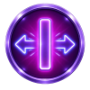
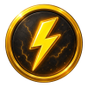
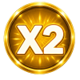
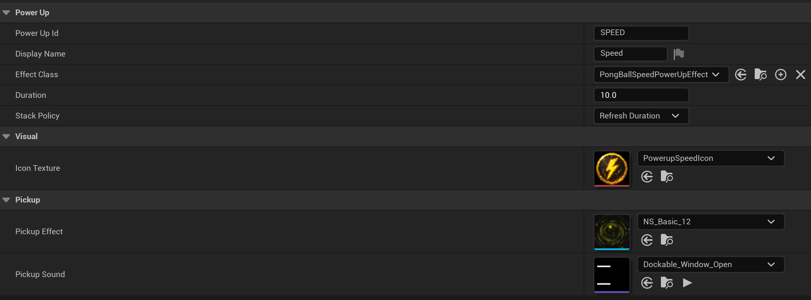
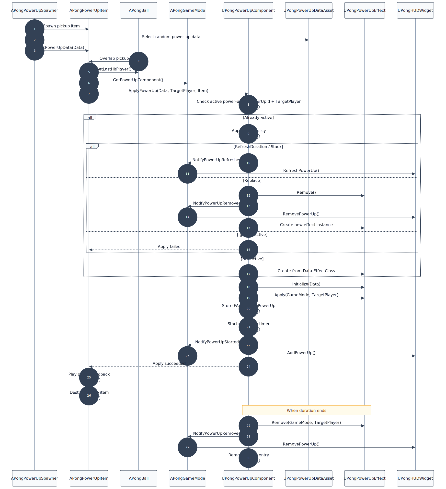
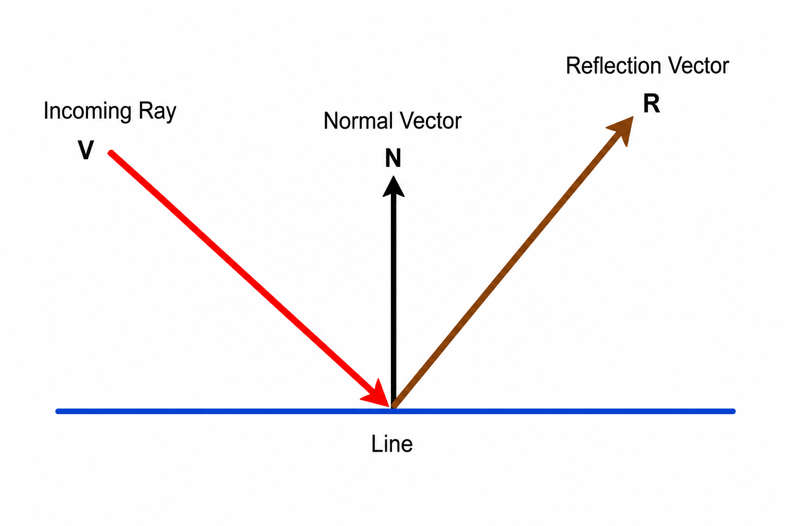

# PongDashDuel

**Tech:** Unreal Engine 5.7.4, C++

**Demo:** [https://www.youtube.com/watch?v=glQvI6FeL1c](https://www.youtube.com/watch?v=glQvI6FeL1c)

## Controls

* **Player 1:** W / S
* **Player 2:** Up / Down
* **Restart:** R

## Win Condition

The first player to reach **7 points** wins the match.

## Original Mechanics

### 1. Momentum Pickups

Power-up items spawn randomly in the play field and are activated when the ball touches them.

The effect goes to the **last player who hit the ball**, so players can aim the ball toward pickups to gain an advantage instead of only trying to return it.

Power-ups:

*  **Paddle Size**: Increases the player's paddle size.
*  **Bullet Shot**: Fires 3 bullets toward the opponent.
*  **Shield**: Creates a temporary shield near the goal.
*  **Speed Boost**: Increases the ball speed.
*  **X2 Score**: Doubles the score from the next goal.

### 2. Electromagnetic Storm Area ⚡

An electromagnetic storm zone can appear on the field. When the ball enters it, the ball is slowed down and redirected in a random direction.

### Why I chose this twist

I wanted the game to feel more tactical and less predictable than a normal Pong match. With pickups and the storm area, players have more reasons to control where they send the ball, not just react to it.

On the technical side, this also gave me a good reason to build the power-up feature as a scalable, data-driven system. New item types and effects can be added without putting all the logic directly into the ball or game mode.

## Third-party Assets

* [Free Arrow Trail](https://www.fab.com/listings/b8ff3ab4-0e81-4335-bbf0-fea15f6fcdfc)
* [Basic VFX Pack](https://www.fab.com/listings/75698e52-edfc-4f76-a86c-b4f26fcf5a29)

## Architecture

### Overview

PongDashDuel is built with a gameplay-actor-based structure in Unreal Engine 5. The main gameplay code is split between GameMode, PlayerController, Actor, ActorComponent, UserWidget, and DataAsset classes.

### Module Structure

* **Core:** game mode, player controller, shared types, collision channels, and global game data.
* **Gameplay:** ball, paddles, goal zones, and danger areas.
* **PowerUps:** power-up data assets, runtime component, effect classes, pickup items, bullets, and shields.
* **UI:** HUD and power-up status widgets.

### Runtime Flow

1. `APongGameMode` starts the match in `BeginPlay`.
2. The game mode caches the main level actors, such as the ball, paddles, and shields.
3. `APongPlayerController` handles player input and forwards movement to the paddles.
4. `APongBall` handles movement, wall bounce, paddle collision, and last-hitter tracking.
5. `APongGoalZone` detects scoring events and notifies the game mode.
6. When the ball touches a power-up item, the effect is assigned to the last player who hit the ball.
7. `UPongPowerUpComponent` handles active power-up effects, including activation, refresh, expiration, and removal.
8. The HUD is updated when the score, winner state, or power-up state changes.

### Power-Up Architecture

Power-ups are data-driven through `UPongPowerUpDataAsset`. Each data asset stores display data, duration, stack behavior, and the effect class to spawn.

The actual behavior is implemented in subclasses of `UPongPowerUpEffect`. `UPongPowerUpComponent` owns the runtime state and manages when effects are applied, refreshed, stacked, expired, or removed.

#### Class Diagram

#### Flow Sequence

### UI Architecture

The HUD is owned by `APongGameMode`. It displays the score, winner state, restart prompt, and active power-ups for each player.

Power-up UI entries are added, refreshed, or removed through game mode notifications.

## Technical Notes

### Ball Reflection

Ball bounce uses the standard reflection vector formula:

**R = V - 2 × Dot(V, N) × N**

Where `R` is the reflected direction, `V` is the incoming ball direction, and `N` is the normalized surface normal.

After calculating the reflected direction, the result is normalized again before being used for movement. This keeps the bounce behavior stable and avoids unwanted speed changes from vector length differences.
